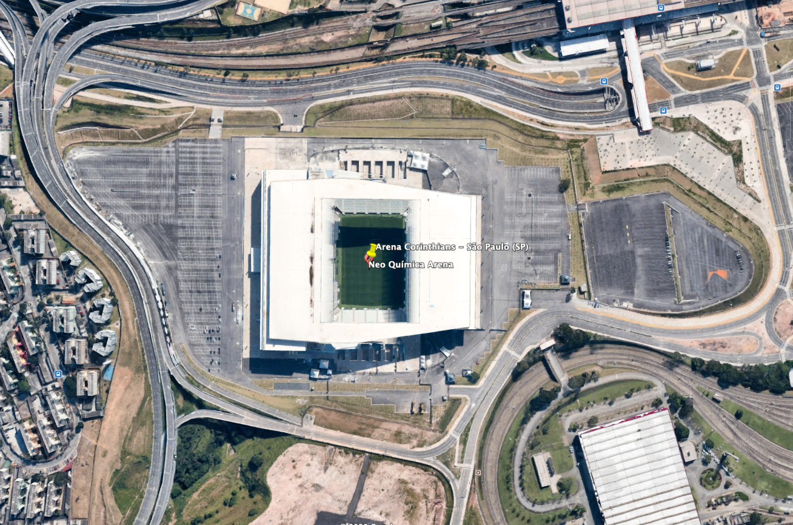
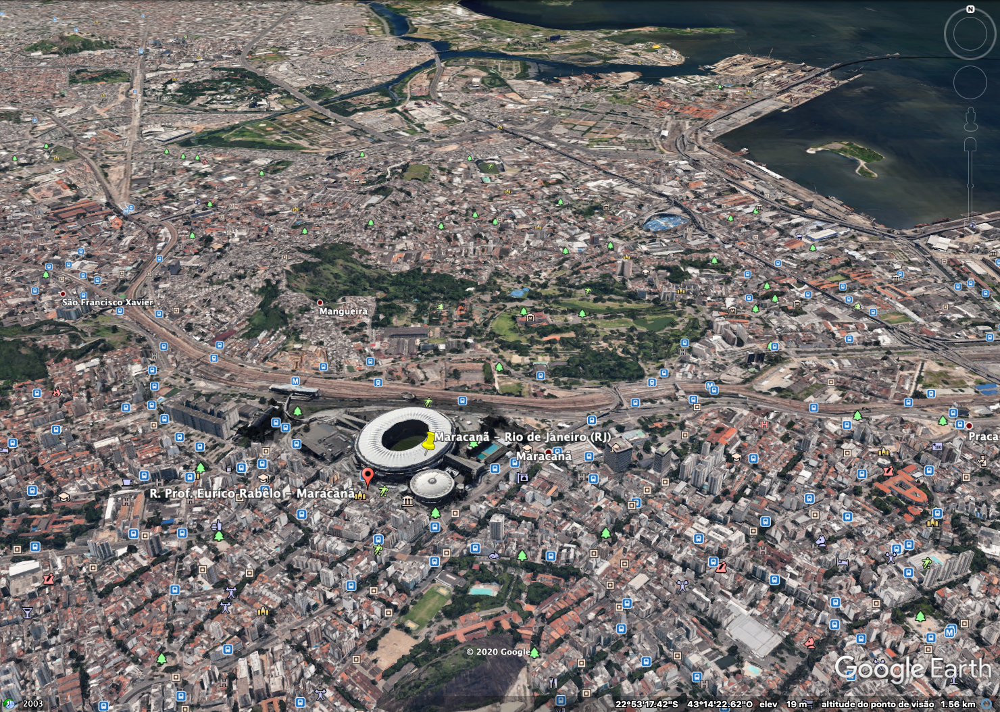
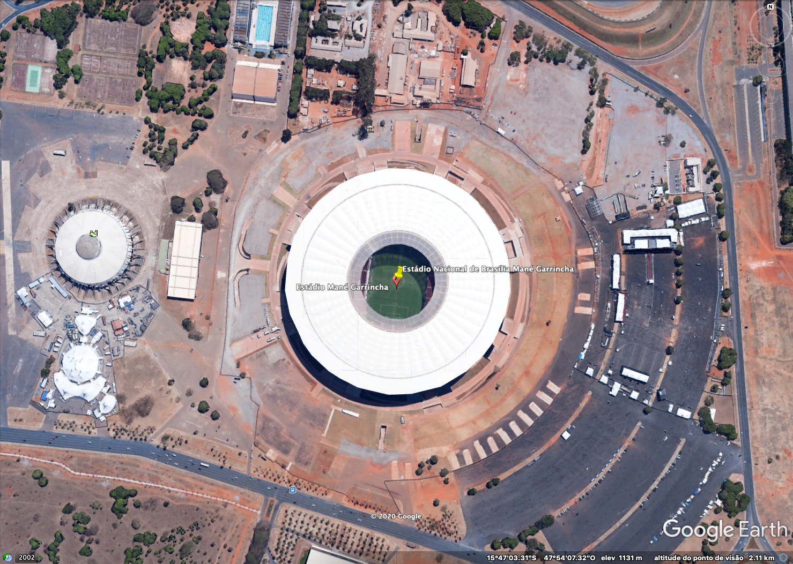

 
 

# Projeto Parcial 2 -  COPA DO MUNDO 2014
## Contexto Geral
## Arena Corinthians

**Nome oficial:** Arena Corinthians

**Endereço:** Av Miguel Inácio Curi,111 - São Paulo - SP 

**Fundação:** 15 de abril de 2014 (segundo os dirigentes do Corinthians)

**Jogo inaugural:** Corinthians 0 x 1 Figueirense, no dia 18 de maio de 2014

**Capacidade:** 68 mil (durante a Copa do Mundo) e 48 mil (após a Copa)

**Custo:** R$ 1,150 bilhão

**Latitude:** 23°32'43.16"S

**Logitude:** 46°28'27.36"O

  

## Maracanã - Rio de Janeiro (RJ)

**Nome oficial:** Estádio Jornalista Mário Filho

**Endereço:** Rua Professor Eurico Rabelo, Maracanã, Rio de Janeiro - RJ

**Fundação:** 16 de junho de 1950

**Jogo inaugural:** seleção carioca 1 x 3 seleção paulista

**Capacidade:** 79 mil

**Custo:** 1,05 bilhão (segundo o Ministério dos Esportes)

**Latitude:** 22°54'45.48"S

**Logitude:**  43°13'46.57"O

  

## Mineirão - Belo Horizonte (MG)

**Nome oficial:** Estádio Governador Magalhães Pinto

**Endereço:** Av. Antônio Abrahão Caram, 1001 - Pampulha, Belo Horizonte (MG)

**Fundação:** 5 de setembro de 1965 (antigo) e 3 de fevereiro de 2013 (novo)

**Jogo inaugural:** Seleção mineira 1 x 0 River Plate (ARG), em 5 de setembro de 1965 (antigo), e Cruzeiro 2 x 1 Atlético-MG, em 3 de fevereiro de 2013 (novo)

**Capacidade:**  62.170 (durante a Copa do Mundo)

**Custo:**  R$ 695 milhões (segundo o Ministério do Esporte)

**Latitude:**  19°51'57.12"S

**Logitude:**   43°58'16.07"O

  

## Estádio Nacional de Brasília Mané Garrincha

**Nome oficial:** Estádio Nacional de Brasília Mané Garrincha

**Endereço:** Setor de Recreação Pública Norte, S/N, Asa Norte - Brasília (DF)

**Fundação:** 10 de março de 1974 (antigo) e 18 de maio de 2013 (novo)

**Jogo inaugural:** Ceub 1 x 3 Corinthians, em 10 de março de 1974 (antigo) e Brasília 0 x 3 Brasiliense, em 18 de maio de 2013 (novo)

**Capacidade:** 70 mil (será a mesma durante a Copa do Mundo)

**Custo:** R$ 1,4 bilhão (segundo o Ministério do Esporte)

**Latitude:**  15°47'0.67"S

**Logitude:**   47°53'57.16"O

  

## Fonte Nova - Salvador (BA)

**Nome oficial:** Complexo Esportivo Octávio Mangabeira

**Endereço:** Ladeira da Fonte Nova das Pedras, s/nº - Nazaré, Salvador (BA)

**Fundação:** 28 de janeiro de 1951 (antigo) e 7 de abril de 2013 (novo)

**Jogo inaugural:** Botafogo-BA 1 x 1 Guarany-BA, em 28 de janeiro de 1951 (antigo), e Bahia 1 x 5 Vitória, em 7 de abril de 2013 (novo)

**Capacidade:** 50 mil (durante a Copa do Mundo)

**Custo:** R$ 689,4 milhões (segundo o Ministério do Esporte)

**Latitude:**  15°47'0.67"S

**Logitude:**   47°53'57.16"O

  

