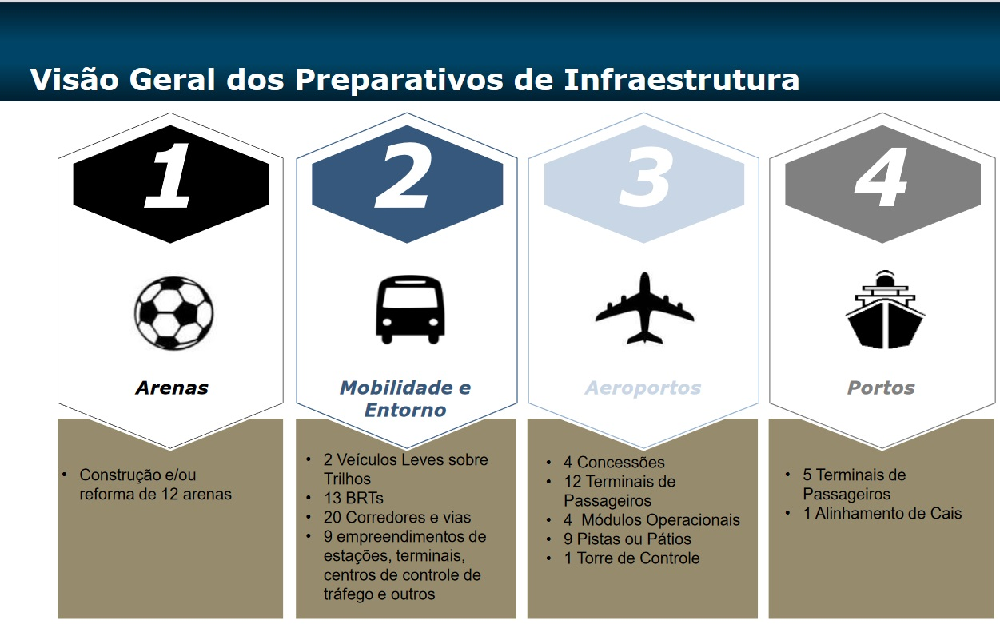
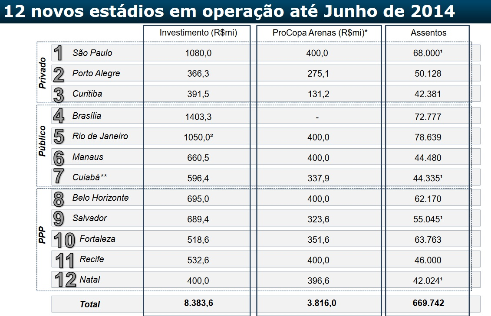
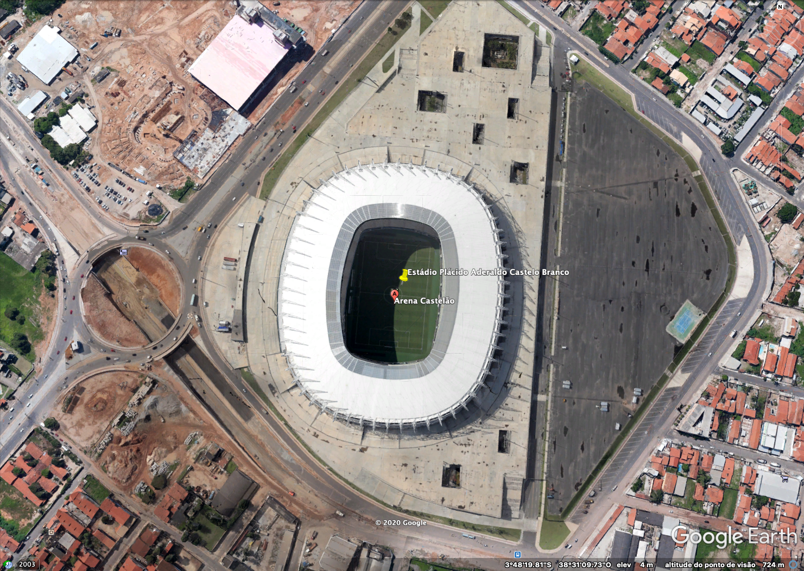
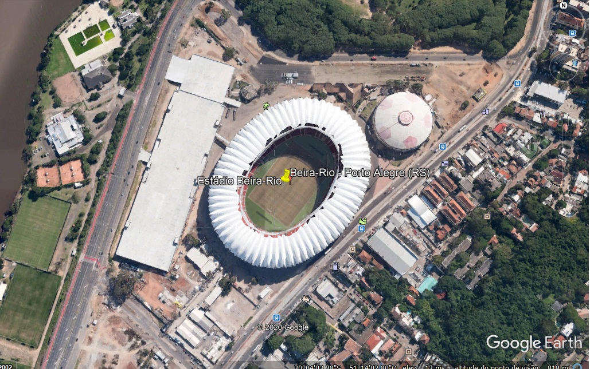
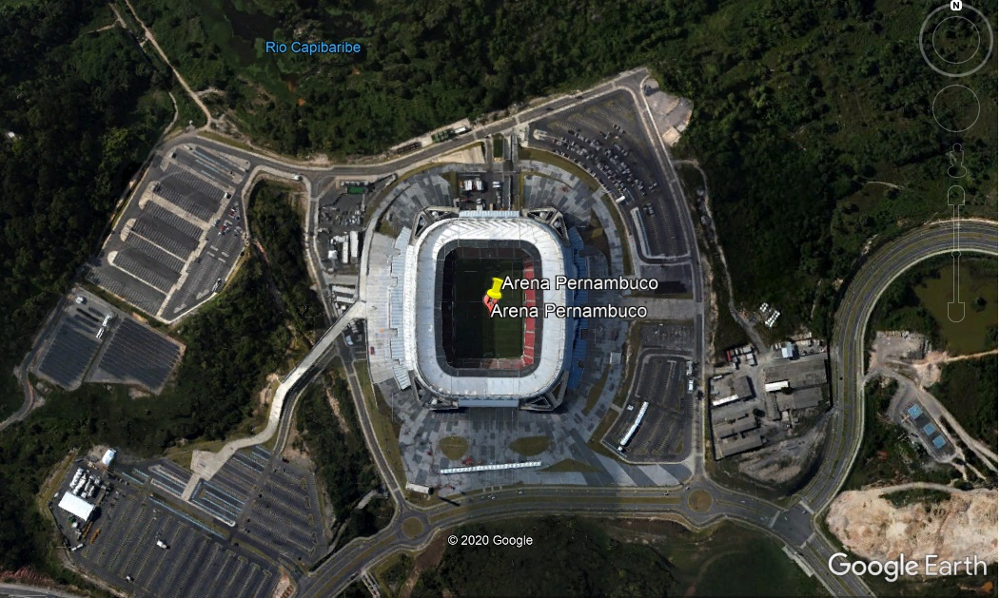
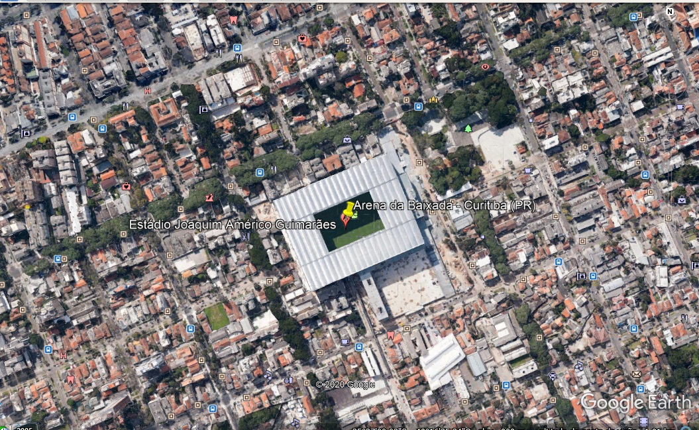
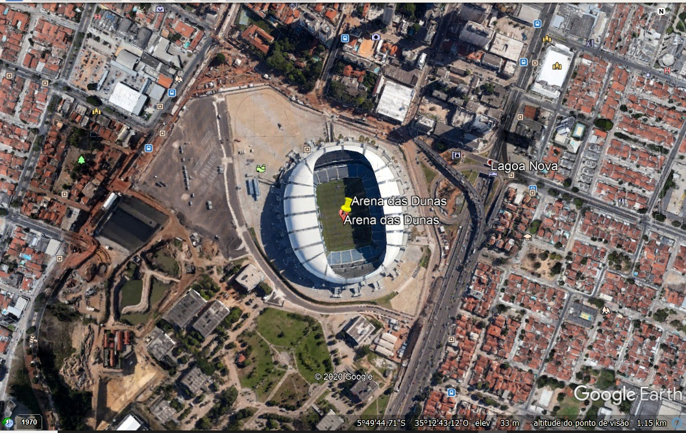
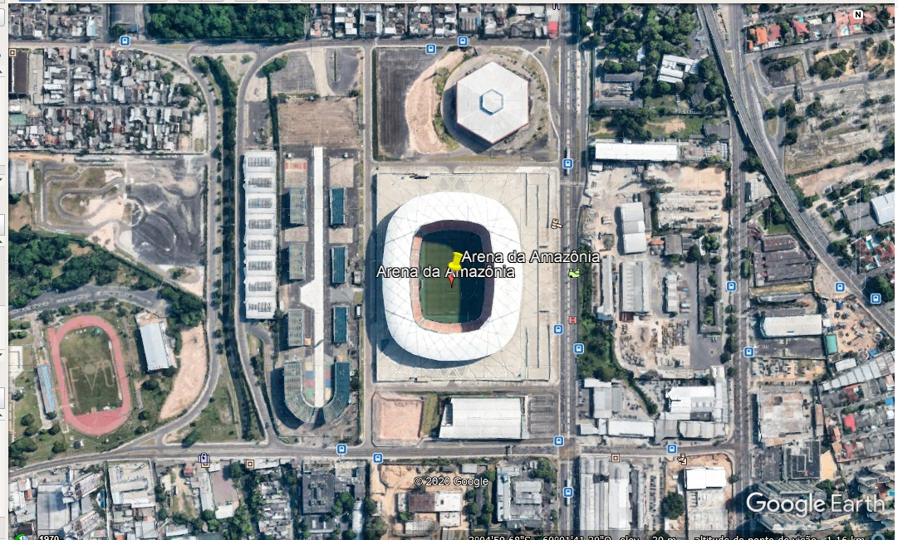
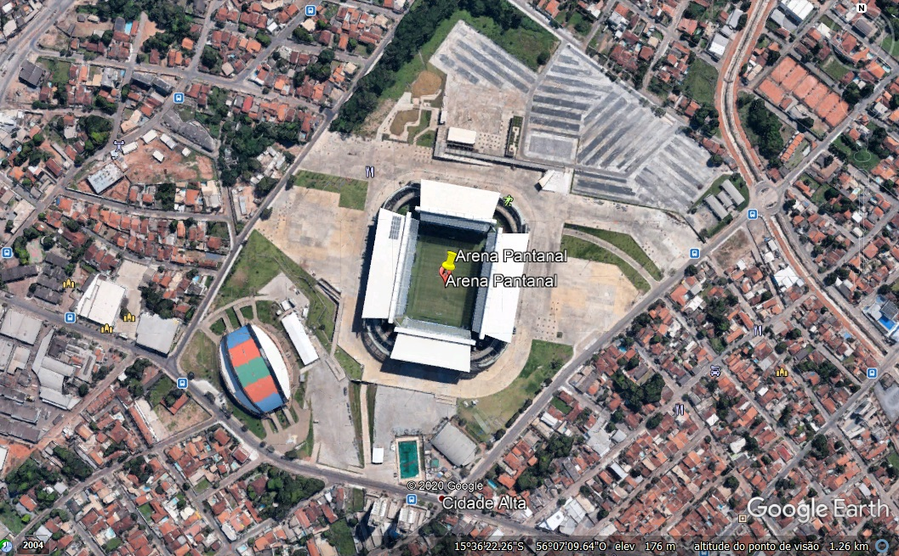

 
 

# Projeto Parcial 2 -  COPA DO MUNDO 2014
## Contexto Geral
A candidatura do Brasil à organização da Copa do 
Mundo de 2014 foi ratificada em 2007, tendo a escolha 
das cidades que iriam sedear o evento sido concluída 
em 2009

os planos do comité organizador preveem inicia
tivas nos domínios dos aeroportos e dos portos, da 
mobilidade urbana, das comunicações, da cultura, da 
saúde, da segurança, da sustentabilidade, da transparência e do turismo (ME, 2012).
Alguns desses projectos são apresentados com mais detalhe, sendo outros 
mencionados de uma forma mais genérica.
no âmbito do planeamento de infraestruturas, o “4
o Balanço das Ações do Governo Brasileiro para a Copa 
2014”, o último tornado público em dezembro de 2014, 
referia os seguintes projectos e acções (ME, 2014)

  

No planeamento (ME, 2014) estavam ainda incluídas iniciativas de ter 12 novos estádios em opreção:

  

## Arena Corinthians

**Nome oficial:** Arena Corinthians

**Endereço:** Av Miguel Inácio Curi,111 - São Paulo - SP 

**Fundação:** 15 de abril de 2014 (segundo os dirigentes do Corinthians)

**Jogo inaugural:** Corinthians 0 x 1 Figueirense, no dia 18 de maio de 2014

**Capacidade:** 68 mil (durante a Copa do Mundo) e 48 mil (após a Copa)

**Custo:** R$ 1,150 bilhão

**Latitude:** 23°32'43.16"S

**Logitude:** 46°28'27.36"O

  

## Maracanã - Rio de Janeiro (RJ)

**Nome oficial:** Estádio Jornalista Mário Filho

**Endereço:** Rua Professor Eurico Rabelo, Maracanã, Rio de Janeiro - RJ

**Fundação:** 16 de junho de 1950

**Jogo inaugural:** seleção carioca 1 x 3 seleção paulista

**Capacidade:** 79 mil

**Custo:** 1,05 bilhão (segundo o Ministério dos Esportes)

**Latitude:** 22°54'45.48"S

**Logitude:**  43°13'46.57"O

  

## Mineirão - Belo Horizonte (MG)

**Nome oficial:** Estádio Governador Magalhães Pinto

**Endereço:** Av. Antônio Abrahão Caram, 1001 - Pampulha, Belo Horizonte (MG)

**Fundação:** 5 de setembro de 1965 (antigo) e 3 de fevereiro de 2013 (novo)

**Jogo inaugural:** Seleção mineira 1 x 0 River Plate (ARG), em 5 de setembro de 1965 (antigo), e Cruzeiro 2 x 1 Atlético-MG, em 3 de fevereiro de 2013 (novo)

**Capacidade:**  62.170 (durante a Copa do Mundo)

**Custo:**  R$ 695 milhões (segundo o Ministério do Esporte)

**Latitude:**  19°51'57.12"S

**Logitude:**   43°58'16.07"O

  

## Estádio Nacional de Brasília Mané Garrincha

**Nome oficial:** Estádio Nacional de Brasília Mané Garrincha

**Endereço:** Setor de Recreação Pública Norte, S/N, Asa Norte - Brasília (DF)

**Fundação:** 10 de março de 1974 (antigo) e 18 de maio de 2013 (novo)

**Jogo inaugural:** Ceub 1 x 3 Corinthians, em 10 de março de 1974 (antigo) e Brasília 0 x 3 Brasiliense, em 18 de maio de 2013 (novo)

**Capacidade:** 70 mil (será a mesma durante a Copa do Mundo)

**Custo:** R$ 1,4 bilhão (segundo o Ministério do Esporte)

**Latitude:**  15°47'0.67"S

**Logitude:**   47°53'57.16"O

  

## Fonte Nova - Salvador (BA)

**Nome oficial:** Complexo Esportivo Octávio Mangabeira

**Endereço:** Ladeira da Fonte Nova das Pedras, s/nº - Nazaré, Salvador (BA)

**Fundação:** 28 de janeiro de 1951 (antigo) e 7 de abril de 2013 (novo)

**Jogo inaugural:** Botafogo-BA 1 x 1 Guarany-BA, em 28 de janeiro de 1951 (antigo), e Bahia 1 x 5 Vitória, em 7 de abril de 2013 (novo)

**Capacidade:** 50 mil (durante a Copa do Mundo)

**Custo:** R$ 689,4 milhões (segundo o Ministério do Esporte)

**Latitude:**  12°58'43.94"S

**Logitude:**    38°30'15.40"O

  

## Castelão - Fortaleza (CE)

**Nome oficial:** Estádio Plácido Aderaldo Castelo Branco

**Endereço:** Avenida Alberto Craveiro, 2901 - Mata Galinha, Fortaleza (CE)

**Fundação:** 11 de novembro de 1973 (antigo) e 27 de janeiro de 2013 (novo)

**Jogo inaugural:** Ceará 0 x 0 Fortaleza, em 11 de novembro de 1973 (antigo), e Fortaleza 0 x 0 Sport e Ceará 0 x 1 Bahia, em 27 de janeiro de 2013 (novo)

**Capacidade:** 63.903 (será a mesma durante a Copa do Mundo)

**Custo:** R$ 518,6 milhões (segundo o Ministério do Esporte)

**Latitude:**   3°48'25.80"S
**Logitude:**  38°31'20.53"O

  

## Beira-Rio - Porto Alegre (RS)

**Nome oficial:** Estádio José Pinheiro Borda (Gigante da Beira-Rio)

**Endereço:** Avenida Padre Cacique, 891 - Praia de Belas - Porto Alegre (RS)

**Fundação:** 6 de abril de 1969

**Jogo inaugural:** Internacional 2 x 1 Benfica, em 6 de abril de 1969

**Capacidade:** 52 mil (durante a Copa do Mundo)

**Custo:** R$ 330 milhões (segundo o Ministério do Esporte)

**Latitude:**    30° 3'56.05"S
**Logitude:**   51°14'9.50"O

  

## Arena Pernambuco - Recife (PE)

**Nome oficial:** Arena Pernambuco

**Endereço:** Av. Deus é Fiel, 01 Letra A - Jardim Penedo, São Lourenço da Mata (PE)

**Fundação:** 14 de abril de 2013

**Jogo inaugural:** Náutico x Sporting-POR, em 22 de maio de 2013

**Capacidade:** 46 mil (será a mesma durante a Copa do Mundo)

**Custo:** R$ 532,6 milhões (segundo o Ministério do Esporte)

**Latitude:**   8° 2'26.39"S
**Logitude:**   35° 0'29.47"O

  

## Arena da Baixada - Curitiba (PR)

**Nome oficial:** Estádio Joaquim Américo Guimarães

**Endereço:**Rua Buenos Aires, 1270 - Curitiba, PR

**Fundação:**  6 de setembro de 1914 (primeira fase) e 20 de junho de 1999 (segunda fase);

**Jogo inaugural:** Internacional-PR 1 x 7 Flamengo (1914)

**Capacidade:** 41 mil

**Custo:** R$ 326,7 milhões (segundo o Ministério dos Esportes)

**Latitude:**    25°26'53.56"S
**Logitude:**    49°16'37.15"O

  

## Arena das Dunas - Natal (RN)

**Nome oficial:** Arena das Dunas

**Endereço:** Av. Prudente de Morais, 5.121 - Lagoa Nova - Natal (RN)

**Fundação:**  22 de janeiro de 2014

**Jogo inaugural:**  América-RN 2 x 0 Confiança, em 26 de janeiro de 2014

**Capacidade:** 43 mil (durante a Copa do Mundo)

**Custo:** R$ 400 milhões (segundo o Ministério dos Esportes)

**Latitude:**      5°49'36.62"S
**Logitude:**     35°12'44.72"O

  

## Arena da Amazônia - Manaus (AM)

**Nome oficial:** Arena da Amazônia

**Endereço:** Av. Constantino Nery, 5001, Chapada - Manaus (AM)

**Fundação:**  9 de março de 2014

**Jogo inaugural:**  Nacional-AM 2 x 2 Remo, em 9 de março de 2014

**Capacidade:** 44 mil pessoas

**Custo:** 669,5 milhões (segundo o Ministério dos Esportes)

**Latitude:**      3° 4'59.68"S
**Logitude:**      60° 1'41.30"O

  

## Arena Pantanal - Cuiabá (MT)

**Nome oficial:** Arena Pantanal

**Endereço:** Avenida Agrícola Paes de Barros, Cuiabá - MT

**Fundação:** marcada para 2 de abril de 2014

**Jogo inaugural:**  Mixto 0 x 0 Santos

**Capacidade:** 44 mil (39.859 durante a Copa)

**Custo:** R$ 646,5 milhões (segundo o Governo de Mato Grosso)

**Latitude:**       15°36'14.47"S
**Logitude:**       56° 7'17.85"O

  

## Referências ##

ME– Ministério do Esporte. “6º Balanço da Copa – Dez/2014”. 
Ministério do Esporte, Governo Federal do Brasil, dezembro de 2014. Disponível em: http://arquivo.esporte.gov.br/arquivos/assessoriaEspecialFutebol/copa2014/6_Balanco_Copa_dez_2014.pdf. Acesso em: 25 de Nov. de 2020.
